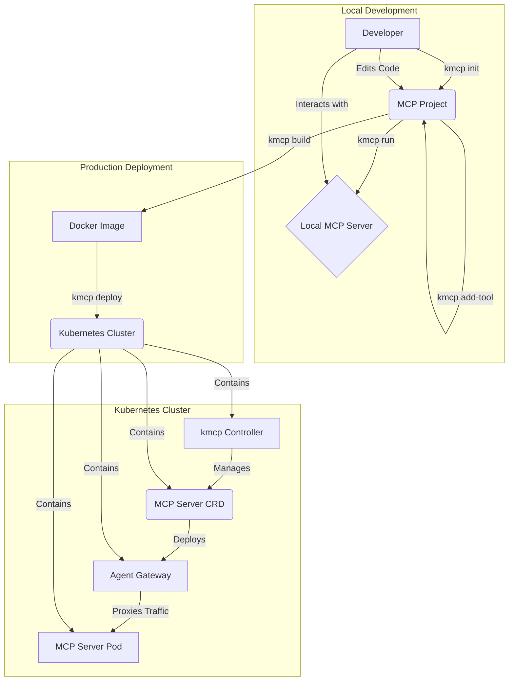

  <picture>
    <source media="(prefers-color-scheme: light)" srcset="https://raw.githubusercontent.com/kagent-dev/kmcp/main/img/kmcp-logo-dark.svg" alt="kmcp" width="400">
    <source media="(prefers-color-scheme: dark)" srcset="https://raw.githubusercontent.com/kagent-dev/kmcp/main/img/kmcp-logo-light.svg" alt="kmcp" width="400">
    
  </picture>
  

    
    
      
    
      
  

# kmcp

**A development platform and control plane for the Model Context Protocol (MCP)**

`kmcp` is a comprehensive toolkit for building, deploying, and managing Model Context Protocol (MCP) servers. It provides a command-line interface (CLI) for local development and a Kubernetes controller for production deployments, enabling a seamless transition from development to production.

## Core Concepts

`kmcp` is composed of three primary components that work together to provide a complete MCP server-management solution:

1.  **The `kmcp` CLI**: The CLI is your primary tool for local development. It allows you to scaffold new MCP projects, manage tools, build container images, and run your MCP server locally for testing and development.

2.  **The Kubernetes Controller**: The `kmcp` controller runs in your Kubernetes cluster and manages the lifecycle of your MCP server deployments. It uses a Custom Resource Definition (CRD) to define MCP servers as native Kubernetes objects, allowing you to manage them with familiar `kubectl` commands.

3.  **The Agent Gateway**: In a Kubernetes environment, `kmcp` deploys your MCP server behind a dedicated [Agent Gateway](https://www.solo.io/press-releases/solo-io-launches-agent-gateway-and-introduces-agent-mesh/). `kmcp` acts as a control plane for this gateway, configuring it to provide enterprise-grade features for your MCP server without requiring any changes to your code. These features include:
    -   Rate limiting
    -   Authorization and Authentication (AuthZ/N)
    -   Observability (tracing, logging, and metrics)
    -   Health checks
    -   TLS Termination

## Features (CLI Command Overview)

The `kmcp` CLI provides a set of commands to manage the entire lifecycle of your MCP server:

-   `kmcp init`: Scaffolds a new MCP server project. Supported frameworks include [FastMCP](https://github.com/jlowin/fastmcp) for Python and the [official MCP Go SDK](https://github.com/mark3labs/mcp-go) for Go.
-   `kmcp add-tool`: Adds a new tool to your project, automatically handling boilerplate and registration.
-   `kmcp run`: Runs the MCP server in a local development environment.
-   `kmcp build`: Builds a Docker image for your MCP server.
-   `kmcp install`: Installs the `kmcp` controller and CRDs on a Kubernetes cluster.
-   `kmcp deploy`: Deploys your MCP server to a Kubernetes cluster, placing it behind a pre-configured Agent Gateway.
-   `kmcp secrets`: Manages secrets for your MCP server deployment in Kubernetes.

## Architecture

The following diagram illustrates the `kmcp` workflow, from local development to a production deployment in Kubernetes:

## Get started

- [Quick Start](https://kagent.dev/docs/kmcp/quickstart)
- [Installation Guide](https://kagent.dev/docs/kmcp/deploy/install-controller)

## Documentation

The kmcp documentation is available at [kagent.dev/docs/kmcp](https://kagent.dev/docs/kmcp).

## 🤝 Contributing

We welcome contributions! Please see our [Contributing Guide](CONTRIBUTING.md) for details.

Thanks to all contributors!

## 📈 Star History

<a href="https://www.star-history.com/#kagent-dev/kmcp&Date">
 <picture>
   <source media="(prefers-color-scheme: dark)" srcset="https://api.star-history.com/svg?repos=kagent-dev/kmcp&type=Date&theme=dark" />
   <source media="(prefers-color-scheme: light)" srcset="https://api.star-history.com/svg?repos=kagent-dev/kmcp&type=Date" />
   
 </picture>
</a>

## 📄 License

Copyright 2025.

Licensed under the Apache License, Version 2.0 (the "License");
you may not use this file except in compliance with the License.
You may obtain a copy of the License at

    http://www.apache.org/licenses/LICENSE-2.0

Unless required by applicable law or agreed to in writing, software
distributed under the License is distributed on an "AS IS" BASIS,
WITHOUT WARRANTIES OR CONDITIONS OF ANY KIND, either express or implied.
See the License for the specific language governing permissions and
limitations under the License.

## 🔗 Resources

- [Model Context Protocol Specification](https://spec.modelcontextprotocol.io/)
- [MCP Documentation](https://modelcontextprotocol.io/)
- [Anthropic's MCP Announcement](https://www.anthropic.com/news/model-context-protocol)
- [FastMCP Python Documentation](https://github.com/jlowin/fastmcp)
