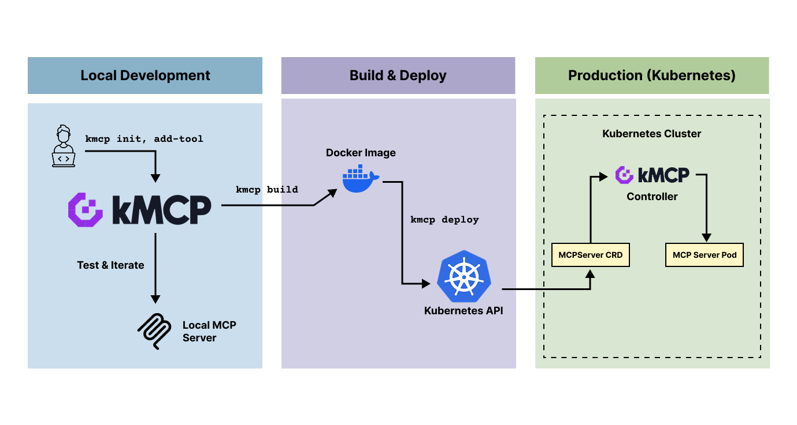
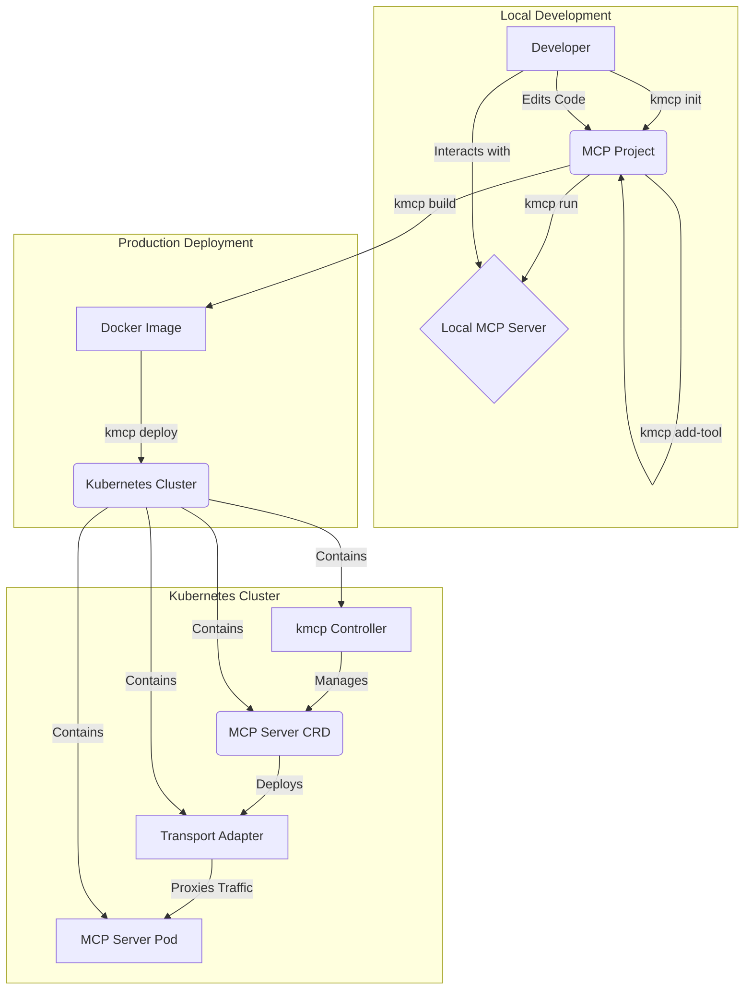

<div align="center">
  <picture>
    <source media="(prefers-color-scheme: light)" srcset="https://raw.githubusercontent.com/kagent-dev/kmcp/main/img/kmcp-logo-dark.svg" alt="kmcp" width="400">
    <source media="(prefers-color-scheme: dark)" srcset="https://raw.githubusercontent.com/kagent-dev/kmcp/main/img/kmcp-logo-light.svg" alt="kmcp" width="400">
    
  </picture>
  <div>
    <a href="https://github.com/kagent-dev/kmcp/releases">
      
    </a>
    <a href="https://github.com/kagent-dev/kmcp/actions/workflows/tag.yaml">
      
    </a>
      <a href="https://opensource.org/licenses/Apache-2.0">
      
    </a>
    <a href="https://github.com/kagent-dev/kmcp">
      
    </a>
      <a href="https://discord.gg/Fu3k65f2k3">
      
    </a>
  </div>
  <h3>A development platform and control plane for the Model Context Protocol (MCP)</h3>
  <p>Build, deploy, and manage MCP servers with a seamless workflow from development to production</p>
</div>

---

## Overview

`kmcp` is a comprehensive toolkit for building, deploying, and managing Model Context Protocol (MCP) servers. It provides a command-line interface (CLI) for local development and a Kubernetes controller for production deployments, enabling a seamless transition from development to production.

Whether you're building AI agent tools, deploying production MCP infrastructure, or managing multiple MCP servers at scale, `kmcp` streamlines the entire lifecycle with familiar tooling and cloud-native deployment patterns.



## Why kmcp?

Building and deploying MCP servers today involves several challenges:

- **Manual scaffolding**: Setting up project structure, dependencies, and boilerplate code for each new MCP server
- **Inconsistent deployment**: No standardized way to deploy MCP servers to production environments
- **Transport complexity**: Handling different transport protocols (HTTP, WebSocket, SSE) requires custom implementation
- **Kubernetes integration**: Manually creating deployments, services, and configurations for each MCP server
- **Dev-prod parity**: Different setups for local development versus production deployment

`kmcp` solves these problems by providing:

- ✨ **Rapid scaffolding** with support for FastMCP (Python) and MCP Go SDK
- 🚀 **One-command deployment** to Kubernetes with pre-configured Transport Adapters
- 🔄 **Consistent workflow** from local development to production
- 🌐 **Built-in transport support** for HTTP, WebSocket, and Server-Sent Events
- ☸️ **Kubernetes-native** using Custom Resource Definitions (CRDs)
- 🔐 **Secrets management** integrated with Kubernetes secrets

## Quick Start

Get started with `kmcp` in under a minute:

```bash
# Install kmcp CLI
curl -fsSL https://raw.githubusercontent.com/kagent-dev/kmcp/refs/heads/main/scripts/get-kmcp.sh | bash

# Create a new MCP server
kmcp init pytohn my-weather-server

# Navigate to your project
cd my-weather-server

# Add a tool
kmcp add-tool get_weather --description "Get current weather for a location"

# Run locally for testing
kmcp run

# Build and deploy to Kubernetes (requires cluster access)
kmcp build
kmcp install  # Install controller (one-time setup)
kmcp deploy
```

Your MCP server is now running locally! Edit the generated tool in `src/tools/get_weather.py` to implement your logic.

## Core Concepts

`kmcp` is composed of three primary components that work together to provide a complete MCP server-management solution:

### 1. The `kmcp` CLI

The CLI is your primary tool for local development. It allows you to scaffold new MCP projects, manage tools, build container images, and run your MCP server locally for testing and development.

### 2.  The Kubernetes Controller

The `kmcp` controller runs in your Kubernetes cluster and manages the lifecycle of your MCP server deployments. It uses a Custom Resource Definition (CRD) to define MCP servers as native Kubernetes objects, allowing you to manage them with familiar `kubectl` commands.

### 3. The Transport Adapter

In a Kubernetes environment, `kmcp` deploys your MCP server behind a dedicated Transport Adapter. `kmcp` acts as a control plane for this adapter, configuring it to provide  features such as external traffic routing for your MCP server with support for multiple transport protocols without requiring any changes to your code.

## Features

The `kmcp` CLI provides a set of commands to manage the entire lifecycle of your MCP server:

| Command | Description |
|---------|-------------|
| `kmcp init` | Scaffolds a new MCP server project with FastMCP (Python) or MCP Go SDK |
| `kmcp add-tool` | Adds a new tool to your project with automatic boilerplate and registration |
| `kmcp run` | Runs the MCP server locally for development and testing |
| `kmcp build` | Builds a Docker image for your MCP server |
| `kmcp install` | Installs the `kmcp` controller and CRDs on a Kubernetes cluster (one-time setup) |
| `kmcp deploy` | Deploys your MCP server to Kubernetes behind a pre-configured Transport Adapter |
| `kmcp secrets` | Manages secrets for your MCP server deployment in Kubernetes |


## Architecture

The following diagram illustrates the `kmcp` workflow, from local development to a production deployment in Kubernetes:



### How It Works

1. **Local Development**: Developers use `kmcp init` to scaffold a new project and `kmcp add-tool` to add tools. The server runs locally with `kmcp run` for rapid iteration.

2. **Build Phase**: `kmcp build` packages your MCP server into a Docker image, handling all dependencies and configuration automatically.

3. **Deployment**: `kmcp deploy` creates a Kubernetes custom resource that the controller watches. The controller then:
   - Deploys your MCP server as a pod
   - Configures and deploys a Transport Adapter as a sidecar or separate service
   - Sets up networking and ingress rules
   - Manages secrets and environment variables

4. **Production Runtime**: The Transport Adapter receives external requests, handles protocol translation, and routes them to your MCP server. The controller continuously monitors and manages the deployment.

## Use Cases

`kmcp` is designed for:

- **AI/ML Engineers**: Building custom tools and integrations for AI agents with rapid iteration and testing
- **Platform Teams**: Managing multiple MCP servers across development, staging, and production environments
- **DevOps Engineers**: Deploying and scaling MCP infrastructure using familiar Kubernetes patterns
- **Enterprise Organizations**: Standardizing MCP server development and deployment across teams
- **Startups**: Quickly prototyping and deploying AI-powered features without infrastructure overhead

## Documentation

The kmcp documentation is available at [kagent.dev/docs/kmcp](https://kagent.dev/docs/kmcp).

## 🤝 Contributing

We welcome contributions! Please see our [Contributing Guide](CONTRIBUTING.md) for details.

### Ways to Contribute

- 🐛 Report bugs and issues
- 💡 Suggest new features
- 📖 Improve documentation
- 🔧 Submit pull requests
- ⭐ Star the repository
- 💬 Help others in Discord

Thanks to all contributors!

<a href="https://github.com/kagent-dev/kmcp/graphs/contributors">
  
</a>

## 📈 Star History

<a href="https://www.star-history.com/#kagent-dev/kmcp&Date">
 <picture>
   <source media="(prefers-color-scheme: dark)" srcset="https://api.star-history.com/svg?repos=kagent-dev/kmcp&type=Date&theme=dark" />
   <source media="(prefers-color-scheme: light)" srcset="https://api.star-history.com/svg?repos=kagent-dev/kmcp&type=Date" />
   
 </picture>
</a>

## 📄 License

Copyright 2025.

Licensed under the Apache License, Version 2.0 (the "License");
you may not use this file except in compliance with the License.
You may obtain a copy of the License at

    http://www.apache.org/licenses/LICENSE-2.0

Unless required by applicable law or agreed to in writing, software
distributed under the License is distributed on an "AS IS" BASIS,
WITHOUT WARRANTIES OR CONDITIONS OF ANY KIND, either express or implied.
See the License for the specific language governing permissions and
limitations under the License.

## 🔗 Resources

- [Model Context Protocol Specification](https://spec.modelcontextprotocol.io/)
- [MCP Documentation](https://modelcontextprotocol.io/)
- [Anthropic's MCP Announcement](https://www.anthropic.com/news/model-context-protocol)
- [FastMCP Python Documentation](https://github.com/jlowin/fastmcp)
- [MCP Go SDK](https://github.com/mark3labs/mcp-go)

--- 

<div align="center">
  <p>Built with ❤️ by the kagent team</p>
  <p>
    <a href="https://kagent.dev">Website</a> •
    <a href="https://kagent.dev/docs/kmcp">Documentation</a> •
    <a href="https://discord.gg/Fu3k65f2k3">Discord</a> •
    <a href="https://github.com/kagent-dev/kmcp">GitHub</a>
  </p>
</div>