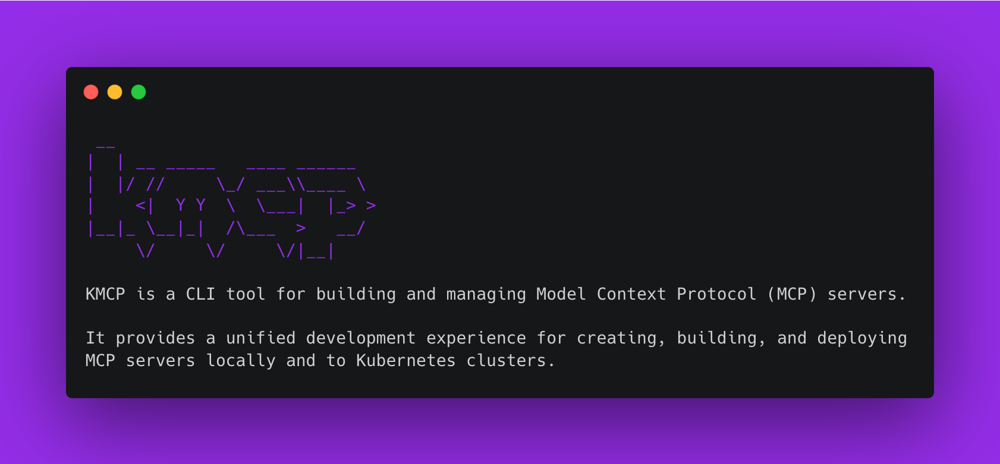

<!-- markdownlint-disable MD033 -->
<div align="center">
  <picture>
    <source media="(prefers-color-scheme: light)" srcset="https://raw.githubusercontent.com/kagent-dev/kmcp/main/img/kmcp-logo-dark.svg" alt="kmcp" width="400">
    <source media="(prefers-color-scheme: dark)" srcset="https://raw.githubusercontent.com/kagent-dev/kmcp/main/img/kmcp-logo-light.svg" alt="kmcp" width="400">
    
  </picture>
  <div>
    <a href="https://github.com/kagent-dev/kmcp/releases">
      
    </a>
    <a href="https://github.com/kagent-dev/kmcp/actions/workflows/tag.yaml">
      
    </a>
      <a href="https://opensource.org/licenses/Apache-2.0">
      
    </a>
    <a href="https://github.com/kagent-dev/kmcp">
      
    </a>
      <a href="https://discord.gg/Fu3k65f2k3">
      
    </a>
  </div>
  <h3>A development platform and control plane for the Model Context Protocol (MCP)</h3>
  <p><i>MCP connectivity simplified, bring MCP service prototypes into production</i></p>
</div>
<!-- markdownlint-enable MD033 -->

---
<!-- markdownlint-disable MD033 -->
<table align="center">
  <tr>
    <td>
      <a href="#getting-started"><b><i>Getting Started</i></b></a>
    </td>
    <td>
      <a href="#from-prototype-to-production"><b><i>Prototype to Production</i><b></a>
    </td>
    <td>
      <a href="#technical-details"><b><i>Technical Details</i></b></a>
    </td>
    <td>
      <a href="#get-involved"><b><i>Get Involved</i></b></a>
    </td>
    <td>
      <a href="#reference"><b><i>Reference</i></b></a>
    </td>
  </tr>
</table>
<!-- markdownlint-disable MD033 -->

---

## Why kMCP?

Prototyping MCP services in isolation is quick and fun, but production adoption introduces many challenges:

- **Ad-hoc scaffolding** - Configuring the MCP server, integrating it in Kubernetes, and operating it at enterprise scale
- **Transport fragmentation** – Supporting multiple protocols (HTTP, WebSocket, SSE, etc.) requires custom maintenance
- **Disconnected context** - Enforcing consistent security, observability, and governance for agent-to-tool communication

**_We believe teams who have build MCP services should not experience friction when bringing those services to production. kMCP is designed to make MCP connectivity simple._**

## Getting Started

Install the kmcp CLI on your local machine.

```bash
curl -fsSL https://raw.githubusercontent.com/kagent-dev/kmcp/refs/heads/main/scripts/get-kmcp.sh | bash
```

Verify that the kmcp CLI is installed.

```bash
kmcp --help
```



_You're ready to go! Continue on to [From Prototype to Production](#from-prototype-to-production) or explore our docs at [kagent.dev/docs/kmcp](https://kagent.dev/docs/kmcp)_

## From Prototype to Production


MCP connectivity affects everyone in an organization. Below are some common quickstart journeys that you may experience:

- [Your first MCP service prototype](https://kagent.dev/docs/kmcp/develop)
- [AI/ML Engineer packaging an existing prototype](https://kagent.dev/docs/kmcp/deploy/server#option-1-deploy-an-mcp-server-with-npx-or-uvx)
- [DevOps engineer building MCP infrastructure in Kubernetes](https://kagent.dev/docs/kmcp/deploy/server#option-2-build-and-deploy-an-mcp-server)

## Technical Details

`kmcp` is a comprehensive toolkit for building, deploying, and managing Model Context Protocol (MCP) servers. For a more detailed breakdown of using kmcp in your workflow, check out our [achitecture overview](/devel/architecture/workflow.md).

### Core Components

- **[CLI](/pkg/cli/README.md)** is your primary tool for development. It allows you to scaffold new MCP projects, manage tools, build container images, and run your MCP server locally for testing and development.
- **Controller**: Manages the lifecycle of your MCP server deployments in your Kubernetes cluster. It uses a Custom Resource Definition (CRD) to define MCP servers as native Kubernetes objects, allowing you to manage them with familiar `kubectl` commands.
- **Transport Adapater** - Fronts the MCP server and provides features such as external traffic routing for your MCP server with support for multiple transport protocols without requiring any changes to your code.

### Core Principles

- ✨ **Rapid scaffolding** with support for FastMCP (Python) and MCP Go SDK
- 🚀 **One-command deployment** to Kubernetes with pre-configured Transport Adapters
- 🔄 **Consistent workflow** from local development to production
- 🌐 **Built-in transport support** for HTTP, WebSocket, and Server-Sent Events
- ☸️ **Kubernetes-native** using Custom Resource Definitions (CRDs)
- 🔐 **Secrets management** integrated with Kubernetes secrets

## Get Involved

_We welcome contributions! Contributors are expected to [respect the kagent Code of Conduct](https://github.com/kagent-dev/community/blob/main/CODE-OF-CONDUCT.md)_

There are many ways to get involved:

- 🐛 [Report bugs and issues](https://github.com/kagent-dev/kmcp/issues/)
- 💡 [Suggest new features](https://github.com/kagent-dev/kmcp/issues/)
- 📖 [Improve documentation](https://github.com/kagent-dev/website/)
- 🔧 [Submit pull requests](/CONTRIBUTING.md)
- ⭐ Star the repository
- 💬 [Help others in Discord](https://discord.gg/Fu3k65f2k3)
- 💬 [Join the kagent community meetings](https://calendar.google.com/calendar/u/0?cid=Y183OTI0OTdhNGU1N2NiNzVhNzE0Mjg0NWFkMzVkNTVmMTkxYTAwOWVhN2ZiN2E3ZTc5NDA5Yjk5NGJhOTRhMmVhQGdyb3VwLmNhbGVuZGFyLmdvb2dsZS5jb20)
- 🤝 [Share tips in the CNCF #kagent slack channel](https://cloud-native.slack.com/archives/C08ETST0076)
- 🔒 [Report security concerns](SECURITY.md)

Thanks to all contributors!

<a href="https://github.com/kagent-dev/kmcp/graphs/contributors">
  
</a>

## Reference

### Resources

- [kMCP documentation](https://kagent.dev/docs/kmcp)

### Ecosystem Resources

- [Model Context Protocol Specification](https://spec.modelcontextprotocol.io/)
- [MCP Documentation](https://modelcontextprotocol.io/)
- [Anthropic's MCP Announcement](https://www.anthropic.com/news/model-context-protocol)
- [FastMCP Python Documentation](https://github.com/jlowin/fastmcp)
- [MCP Go SDK](https://github.com/mark3labs/mcp-go)

### License

This project is licensed under the [Apache 2.0 License.](/LICENSE)

---

<div align="center">
  <p>Built with ❤️ by the <a href="https://github.com/kagent-dev">kagent team</a> </p>
</div>
