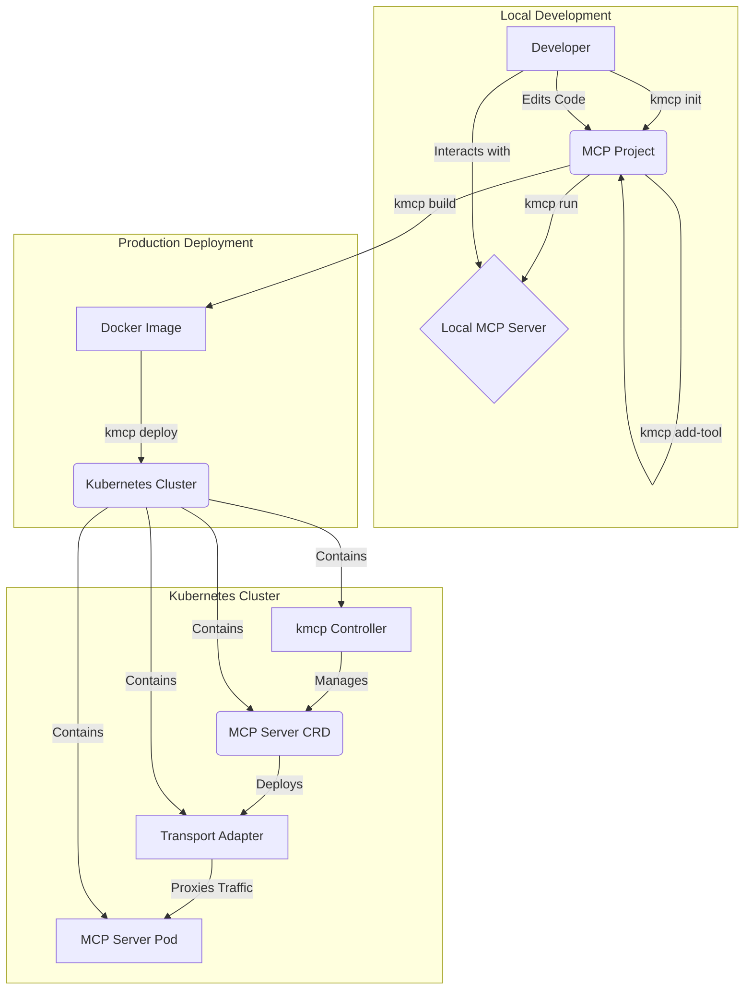

# kMCP Workflow

The following diagram illustrates the `kmcp` workflow, from local development to a production deployment in Kubernetes:

## How It Works

1. **Local Development**: Developers use `kmcp init` to scaffold a new project and `kmcp add-tool` to add tools. The server runs locally with `kmcp run` for rapid iteration.

2. **Build Phase**: `kmcp build` packages your MCP server into a Docker image, handling all dependencies and configuration automatically.

3. **Deployment**: `kmcp deploy` creates a Kubernetes custom resource that the controller watches. The controller then:
   - Deploys your MCP server as a pod
   - Configures and deploys a Transport Adapter as a sidecar or separate service
   - Sets up networking and ingress rules
   - Manages secrets and environment variables

4. **Production Runtime**: The Transport Adapter receives external requests, handles protocol translation, and routes them to your MCP server. The controller continuously monitors and manages the deployment.